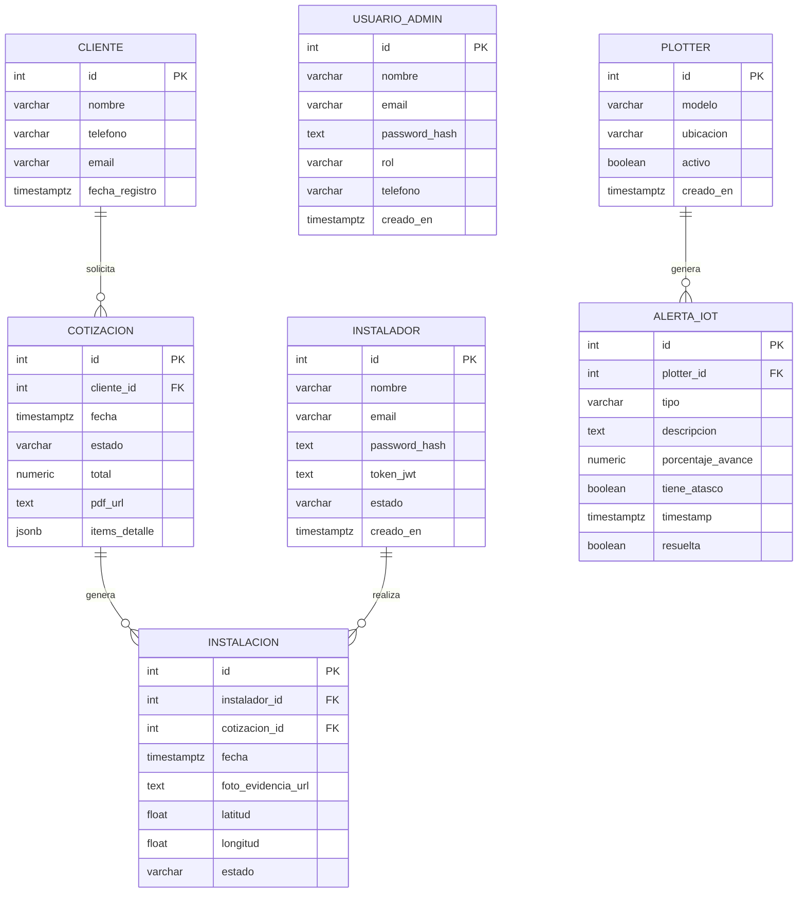

# MER — APP-GD-OS
**Global Design Operating System | Tomás Escobar — Matías Ampuero | 2026**

```mermaid
erDiagram
    CLIENTE {
        int id PK
        varchar nombre
        varchar telefono
        varchar email
        timestamptz fecha_registro
    }

    COTIZACION {
        int id PK
        int cliente_id FK
        timestamptz fecha
        varchar estado
        numeric total
        text pdf_url
        jsonb items_detalle
    }

    USUARIO_ADMIN {
        int id PK
        varchar nombre
        varchar email
        text password_hash
        varchar rol
        varchar telefono
        timestamptz creado_en
    }

    INSTALADOR {
        int id PK
        varchar nombre
        varchar email
        text password_hash
        text token_jwt
        varchar estado
        timestamptz creado_en
    }

    INSTALACION {
        int id PK
        int instalador_id FK
        int cotizacion_id FK
        timestamptz fecha
        text foto_evidencia_url
        float latitud
        float longitud
        varchar estado
    }

    PLOTTER {
        int id PK
        varchar modelo
        varchar ubicacion
        boolean activo
        timestamptz creado_en
    }

    ALERTA_IOT {
        int id PK
        int plotter_id FK
        varchar tipo
        text descripcion
        numeric porcentaje_avance
        boolean tiene_atasco
        timestamptz timestamp
        boolean resuelta
    }

    CLIENTE        ||--o{ COTIZACION   : "solicita"
    COTIZACION     ||--o{ INSTALACION  : "genera"
    INSTALADOR     ||--o{ INSTALACION  : "realiza"
    PLOTTER        ||--o{ ALERTA_IOT   : "genera"
```
