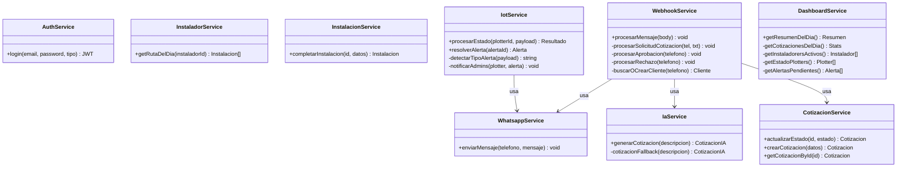
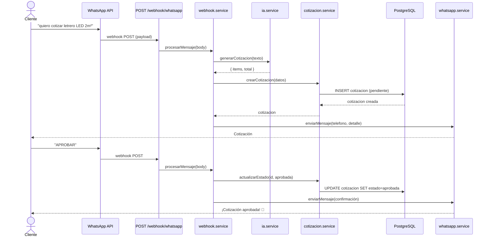
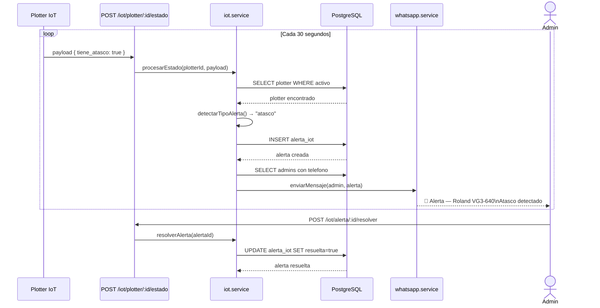
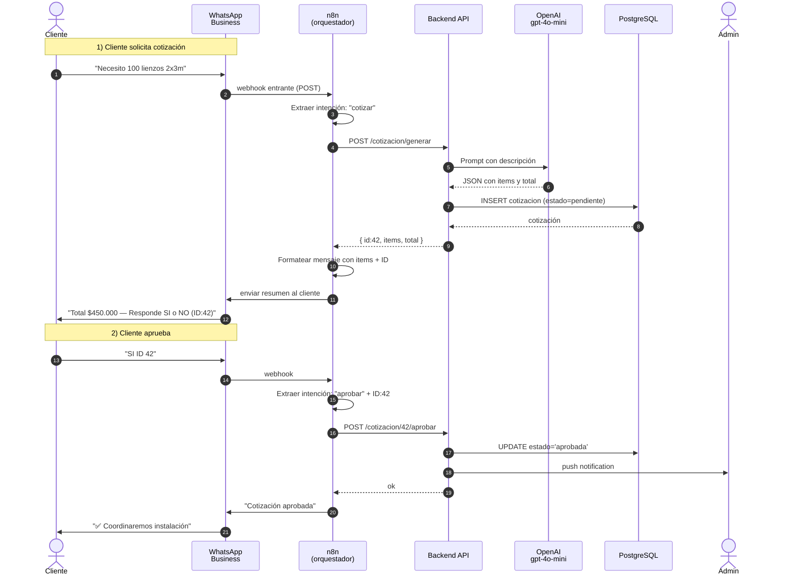
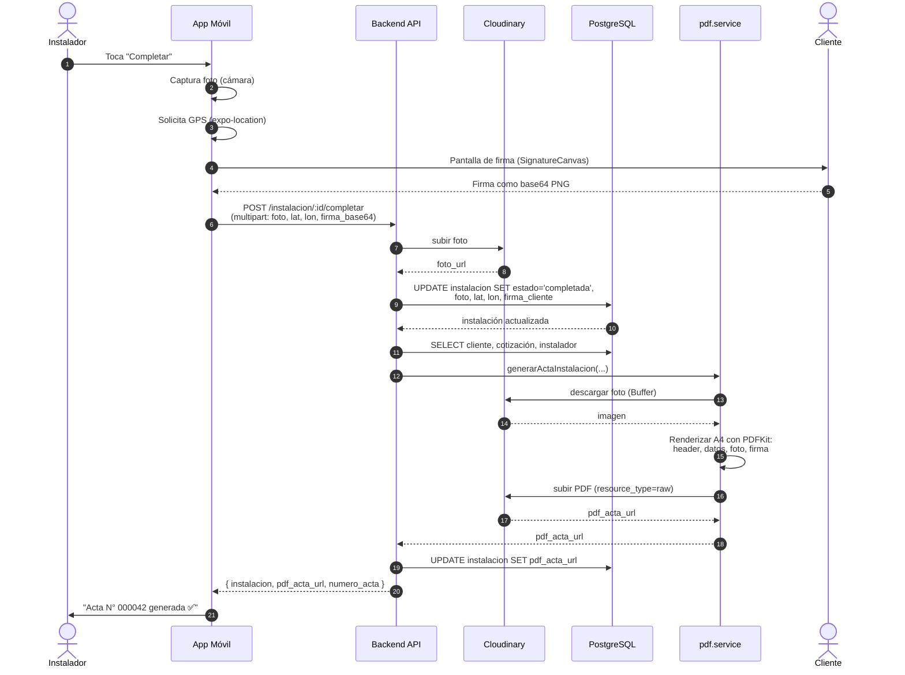

# UML — APP-GD-OS
**Global Design Operating System | Tomás Escobar — Matías Ampuero | 2026**

---

## 1. Diagrama de Componentes — Arquitectura por Capas

```mermaid
graph LR
    subgraph Clientes
        APP["📱 App Móvil\nExpo"]
        WA["💬 WhatsApp\nBusiness"]
        IOT["⚙️ Plotter\nIoT"]
        WEB["🖥️ Dashboard\nAdmin"]
    end

    subgraph API["Backend Node.js + Express"]
        subgraph Routes
            R1[auth.routes]
            R2[webhook.routes]
            R3[cotizacion.routes]
            R4[instalador.routes]
            R5[instalacion.routes]
            R6[iot.routes]
            R7[dashboard.routes]
        end

        subgraph Controllers
            C1[auth.controller]
            C2[webhook.controller]
            C3[cotizacion.controller]
            C4[instalador.controller]
            C5[instalacion.controller]
            C6[iot.controller]
            C7[dashboard.controller]
        end

        subgraph Services
            S1[auth.service]
            S2[webhook.service]
            S3[cotizacion.service]
            S4[instalador.service]
            S5[instalacion.service]
            S6[iot.service]
            S7[dashboard.service]
            S8[ia.service]
            S9[whatsapp.service]
        end

        subgraph Middlewares
            M1[verifyToken]
            M2[requireRole]
            M3[validate]
            M4[errorHandler]
        end
    end

    subgraph Externos["Servicios Externos"]
        DB[(PostgreSQL)]
        CLD[Cloudinary]
        OAI[OpenAI API]
        WAS[WhatsApp API]
    end

    APP & WA & IOT & WEB --> Routes
    Routes --> Middlewares
    Middlewares --> Controllers
    Controllers --> Services
    Services --> DB
    Services --> CLD
    Services --> OAI
    Services --> WAS
```

---

## 2. Diagrama de Clases — Servicios

---

## 3. Diagrama de Secuencia — Flujo WhatsApp

---

## 4. Diagrama de Secuencia — Flujo IoT

---

## 5. Diagrama de Secuencia — Flujo n8n WhatsApp completo

---

## 6. Diagrama de Secuencia — Completar Instalación con Acta PDF

